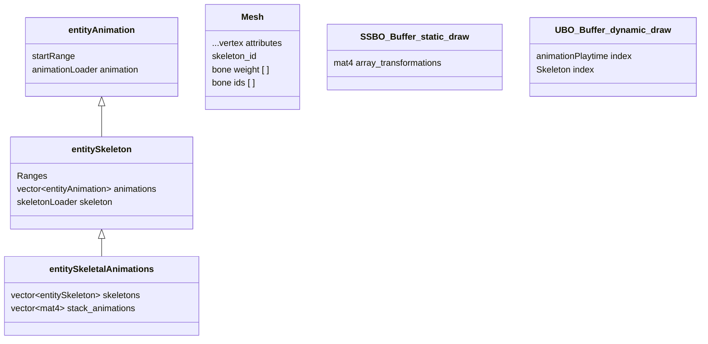

# DeusEx Machina engine
C++/GL/Vulkan 3D graphic engine

This project should be an abstraction of the engine that I am using on BOC: Birth of Cultures, my intention is to be able to dedicate some time each month to update this OpenSource project, Deus Ex Machina is focused on performance, using most moderns indirect draw APIs, to avoid drawing API overdrive as a first major goal.

Shaders aren't a target on this project (compiling/implement are out of this), but I still can recommend the [Book of Shaders](https://thebookofshaders.com/), which so far is the best online resource that I could find.

First commit, hello world! :D
Here is my [Reddit post](https://www.reddit.com/r/BirthOfCivilization/comments/smbddl/deus_ex_machina_engine_first_public_repository/) about why I started with a skeletal animation system. Additionally, I also discuss the future updates for this project.

# Table of Contents
[1. MultiDraw Elements Indirect](https://github.com/BraisMarteloLopez/Deus_Ex_Machina_engine#1-multidraw-elements-indirect)
[2. Multi-threading and Asynchronous Chunks Sync](https://github.com/BraisMarteloLopez/Deus_Ex_Machina_engine#2-multi-threading-and-asynchronous-chunks-sync)
[3. Interface Items System](https://github.com/BraisMarteloLopez/Deus_Ex_Machina_engine#3-interface-items-system)
[4. Skeleton Animation](https://github.com/BraisMarteloLopez/Deus_Ex_Machina_engine#4-skeleton-animation)

- [ ] More content coming in the near future, watch this space!

# 1. MultiDraw Elements Indirect
- [ ] Coming in the next update

# 2. Multi-threading and asynchronous chunks sync
- [ ] Pending organization

# 3. Interface Items system
- [ ] Pending organization

# 4. Skeleton Animation
Skeleton animation system should not have numbers restrictions on how many skeletons, animations, keyframes or even how many game entities use each one of them, for this reason there are two separate buffers with different purposes. The first is static while the other is dynamic, the GPU allows the interpolation between two final positions, while the CPU only takes care of computing animations at play time. There are no forms of uniform over-load, the uniform buffer object is the only point to sync, (the 32 kb size of that guarantees a fast cpu<->gpu update). All animations transforms are pre-computed inside the static buffer to avoid extra CPU load on runtime.

<!--  -->
## Simplified data atlas

(pending to end update)

# Dependencies

- ASSIMP: `vcpkg install assimp`.
- GLM: `vcpkg install glm`.
- GLAD: `vcpkg install glad`.
- GLFW: `vcpkg install glfw3`.

